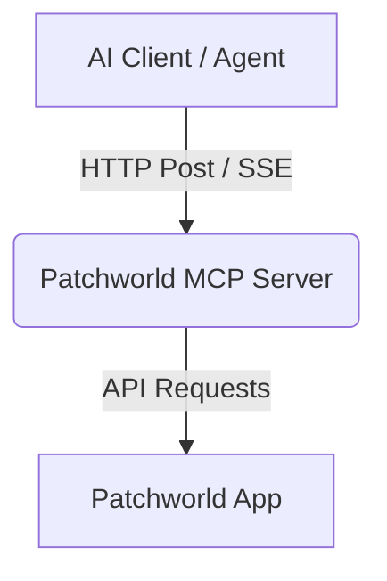

# Connecting Patchworld MCP to AI Agents

The Patchworld Model Context Protocol (MCP) server enables AI agents to interact directly with the Patchworld app. This allows agents to perform complex, contextual actions such as spawning entities, connecting blocks, and querying real-time state information.

---

## 1. Architecture Overview
The Patchworld MCP server runs as a remote HTTP service. AI clients connect to the server using the Model Context Protocol to access Patchworld-specific tools.



To see the full capabilities and available tools, refer to the [Tools Reference](tools.md) page.

---

## 2. Configuration for Supported AI Clients
Configure the Patchworld MCP server under the appropriate configuration file for your AI client. Make sure to replace `<YOUR_BEARER_TOKEN>` with your actual authorization key.

### Claude Code
Claude Code manages global MCP servers in the user-level configuration file:
* **File Location:** `~/.claude.json`
* **Configuration:**
  ```json
  "mcpServers": {
    "patchworld": {
      "type": "http",
      "url": "https://api.patchxr.io/mcp",
      "headers": {
        "Authorization": "Bearer <YOUR_BEARER_TOKEN>"
      }
    }
  }
  ```

### Google Antigravity
Google Antigravity CLI manages global MCP servers in its global configuration file:
* **File Location:** `~/.gemini/antigravity-cli/mcp_config.json`
* **Configuration:**
  ```json
  {
    "mcpServers": {
      "patchworld": {
        "serverUrl": "https://api.patchxr.io/mcp",
        "headers": {
          "Authorization": "Bearer <YOUR_BEARER_TOKEN>"
        }
      }
    }
  }
  ```

### Other Clients
The Patchworld MCP server is compatible with any development tool or client that supports the Model Context Protocol (MCP). If you are using a different tool, you can simply ask your AI agent to help you connect it using the parameters provided in the configurations above.

